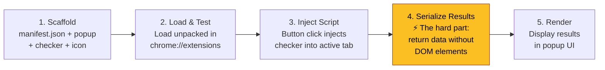
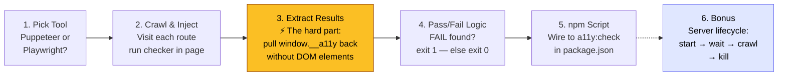

# 🏗️ Build & Compete: Automate Your QC Tooling

**Theme**: *Take a real challenge and build toward it — together or in parallel. Vibe-code around a new tech concept and try to componentize it.*

---

## The Problem (Real & Relatable)

We have [a11y-quick-check.js](file:///home/ces-user/Downloads/accessibility-app/scripts/a11y-quick-check.js) — a powerful console script that audits pages for contrast, font size, heading structure, and British/American spelling. Today, using it means:

1. Open DevTools on each page
2. Paste the script manually
3. Read the console output
4. Navigate to the next route, repeat

**This is tedious, error-prone, and doesn't scale.** The challenge: how do you turn a manual DevTools workflow into something automated, reusable, and componentized?

---

## 🕐 Session Agenda (60 minutes)

| Time | Phase | What Happens |
|------|-------|-------------|
| 0–5 min | **Context & Demo** | Show the problem live. Paste the script, show the output. Ask: *"Would you want to do this on 50 pages?"* |
| 5–10 min | **Challenge Reveal + Pickup** | Present the challenge tracks. Teams/individuals pick a track. Clone the repo. |
| 40 min | **Build Phase (40 min)** | Vibe-code! Use AI assistants, pair, Google, whatever works. |
| 50–60 min | **Show & Tell** | Each track demos what they built (even if incomplete). Key learnings discussion. |

---

## 🎯 The Challenge: Pick Your Track

> [!IMPORTANT]
> **All tracks solve the same core problem**: *"How do I stop manually pasting this script everywhere?"*
> Each track teaches a different automation concept that's transferable to any project.

### Track A: 🧩 The Chrome Extension

**Concept**: Build a Chrome extension that injects the checker with one click — no more pasting

**Why this is the most natural solution**: The pain point is literally *"I have to paste a script into DevTools every time."* A browser extension is exactly what Chrome built for this. You click a button, it runs the script on any page, done.

**The task**:
- Build a Chrome extension (Manifest V3) with:
  - A popup with a **"Run A11y Check"** button
  - On click, inject `a11y-quick-check.js` into the active tab using `chrome.scripting.executeScript()`
  - Display the results (contrast fails, heading issues, spelling) back in the popup UI
  - Bonus: add a badge count showing number of issues found

**What you'll learn (transferable)**:
- Chrome Extension architecture (manifest.json, popup, content scripts)
- `chrome.scripting.executeScript()` — injecting code into any page
- Message passing between popup ↔ content script contexts
- This pattern works for **any** browser tooling: performance auditors, cookie inspectors, SEO checkers, JSON formatters, screenshot tools

**Suggested flow**:



**Research these**:
- 🔍 "Chrome Extension Manifest V3 getting started" — understand `manifest.json` structure, `permissions`, and `action`
- 🔍 `chrome.scripting.executeScript()` — how to inject JS files or functions into a tab
- 🔍 `chrome.tabs.query()` — how to get the currently active tab
- 🔍 "Chrome extension structured clone" — why you can't return DOM elements from `executeScript`
- 🔍 "Load unpacked Chrome extension" — how to test locally without publishing

---

### Track B: 🤖 The Headless Automation + npm Command

**Concept**: Use Puppeteer/Playwright to crawl all routes automatically — then make it a proper `npm run` command that can gate your CI pipeline

**The task**:
- Write a Node.js script that:
  - Launches a headless browser and visits all 4 routes
  - Injects and runs `a11y-quick-check.js` on each page
  - Collects results across all routes into a JSON report
  - Exits with code `1` if any contrast `FAIL` or heading violations exist
- Wire it to `npm run a11y:check` in `package.json`
- **Bonus**: handle the full server lifecycle — start the dev server, wait for it to be ready, run the crawl, kill the server, all from one command

**What you'll learn (transferable)**:
- Browser automation basics (`page.evaluate()`, `page.goto()`)
- Process orchestration — spawning and managing child processes from Node.js
- Exit codes as a CI contract: any tool that exits `1` fails a CI step
- This pattern applies to: **visual regression, E2E smoke tests, bundle size budgets, broken link checks, any quality gate you want to automate**

**Suggested flow**:



**Research these**:
- 🔍 "Puppeteer getting started" or "Playwright getting started" — basic launch → goto → close
- 🔍 `page.evaluate()` — running arbitrary JS in the browser context and returning serializable data
- 🔍 `page.addScriptTag()` — alternative way to inject a .js file into a page
- 🔍 `process.exit(1)` — how CLI tools signal failure to a shell or CI runner
- 🔍 `child_process.spawn()` or the `execa` package — starting the Vite dev server from a Node script
- 🔍 `wait-on` package — polling until `localhost:5173` is ready before crawling
- 🔍 "npm script pre/post hooks" — chaining setup/teardown around your main command

---

## 🧠 Why This Challenge Works for Future Work

> [!TIP]
> **The real lesson isn't about accessibility — it's about these transferable patterns:**

| Pattern | What you practiced | Where you'll use it again |
|---------|-------------------|--------------------------|
| **Browser extensions** | Manifest V3, chrome.scripting, popup UI | Any internal dev tool, SEO checker, cookie inspector, JSON formatter |
| **Browser automation + CI gates** | Puppeteer/Playwright + exit codes + npm scripts | E2E testing, visual regression, bundle budgets, any automated quality check |

---

## 📋 Pre-Session Checklist (for you as host)

- [ ] **Repo ready**: Push the repo to a shared Git location or prepare a zip
- [ ] **Dependencies**: Ask participants to `npm install` before the session (or allow 5 min for setup)
- [ ] **For Track B**: Participants need `npx puppeteer` or `npx playwright` (can install during build phase)
- [ ] **Demo prep**: Have the app running locally so you can do the live demo in the first 10 min
- [ ] **Optional**: Prepare a shared doc/board (Google Doc, FigJam, Miro) where teams can paste their approach/code snippets for the Show & Tell

---

## 🎤 How to Host the Context & Demo Phase (0–10 min)

### Script for the opening:

1. **Start with the pain** (2 min):
   > *"Here's a real tool we use — it checks contrast, font sizes, heading structure, and spelling. Let me show you what using it looks like today..."*
   
   - Open the app at `localhost:5173`
   - Open DevTools → Console
   - Paste `a11y-quick-check.js`, show the output
   - Navigate to `/page-two`, paste again, show output
   - *"Imagine doing this on 50 pages. Every sprint."*

2. **Frame the challenge** (2 min):
   > *"The script itself is solid. The problem is the workflow around it. Today's challenge: how would you automate this? There's no single right answer — that's the point."*

3. **Present the tracks** (3 min):
   - Show the 4 tracks, explain difficulty levels
   - *"Pick what excites you, not what's easiest. The goal is learning, not finishing."*

4. **Form teams** (3 min):
   - Let people self-organize (solo, pairs, or small groups)
   - *"Same track? Compete! Different tracks? You'll learn from each other's demos."*

---

## 💡 Facilitation Tips

> [!NOTE]
> **"Learning through building" means the process matters more than the output.**

1. **Walk the room** during the build phase. Don't just wait. Ask:
   - *"What approach are you trying?"*
   - *"What's blocking you right now?"*
   - *"What did you Google / ask AI for?"*

2. **Normalize being stuck**. If someone is lost at 25 min, that's fine — help them pivot to a simpler scope within their track.

3. **Celebrate partial solutions** in Show & Tell. A team that only got `manifest.json` + `popup.html` wired up but didn't finish the results display? That's still a real win — they learned the Chrome Extension architecture.

4. **End with the transferable insight**. After Show & Tell, spend 2 minutes connecting what they built to their real projects:
   > *"Track A people — next time you need a quick internal tool for your team, you now know how to ship a Chrome extension in an afternoon. Track B people — next time someone says 'can we automate X', you know Puppeteer can do it."*

---

## 🏆 Optional: Competitive Elements

- **Creative prize**: Most unexpected approach or extension beyond the brief
- **"Learner" prize**: Best explanation of what they learned (encourages reflection)

---

## 🎯 Alternative Challenge Scoping (if 40 min feels too tight)

*"Instead of picking separate tracks, everyone's working on the same thing*

*We're building a Chrome extension together. The `manifest.json` and `popup.html` are done for you. Your job is to make it actually work.*

*Here's how we're slicing the 40 minutes:"*

| Time | Step | What you're solving |
|------|------|---------------------|
| 0–10 min | **Adapt the checker** | Take `a11y-quick-check.js` and turn it into a `checker.js` that *returns* results instead of writing to `window.__a11y` — this is the key insight |
| 10–25 min | **Wire the popup** | In `popup.js`, on button click: inject `checker.js` into the active tab, get results back, no console involved |
| 25–35 min | **Build the results UI** | Render what came back into the popup — even a plain table is a win |
| 35–40 min | **Polish & extend** | Badge count, better styling, show issue counts per category |

> *"The extension files are in the repo — grab them and load unpacked in `chrome://extensions`. Your only goal for the first 10 minutes is to get the extension icon to appear. Everything else builds from there."*

---

## 📎 Track A Starter Hints (Chrome Extension)

> [!NOTE]
> These are reference files to hand out to Track A participants (or everyone, if using the alternative scoping above). The extension scaffolding is done — their job is to write `checker.js` and complete `popup.js`.

**`manifest.json`**:
```json
{
  "manifest_version": 3,
  "name": "A11y Quick Check",
  "version": "1.0",
  "description": "One-click accessibility audit for any page",
  "permissions": ["activeTab", "scripting"],
  "action": {
    "default_popup": "popup.html",
    "default_title": "Run A11y Check"
  }
}
```

**`popup.html`**:
```html
<!DOCTYPE html>
<html>
<head><style>
  body { width: 400px; padding: 12px; font-family: system-ui; }
  button { padding: 8px 16px; cursor: pointer; }
  table { width: 100%; font-size: 12px; border-collapse: collapse; margin-top: 8px; }
  td, th { border: 1px solid #ddd; padding: 4px; text-align: left; }
</style></head>
<body>
  <h3>♿ A11y Quick Check</h3>
  <button id="run">Run Check on This Page</button>
  <div id="results"></div>
  <script src="popup.js"></script>
</body>
</html>
```

**`popup.js`** — the key wiring (participants complete the `formatResults` function and adapt `checker.js` to return data):
```js
document.getElementById('run').addEventListener('click', async () => {
  const [tab] = await chrome.tabs.query({ active: true, currentWindow: true })

  const [{ result }] = await chrome.scripting.executeScript({
    target: { tabId: tab.id },
    files: ['checker.js'],   // injects our adapted checker into the page
  })

  // result = whatever checker.js returns
  // Render it into #results
  document.getElementById('results').innerHTML = formatResults(result)
})
```

> [!IMPORTANT]
> **The challenge**: `checker.js` must end with `return { ... }` containing only plain serializable data — no DOM element references. This is the key difference from the original script that stores to `window.__a11y`.
